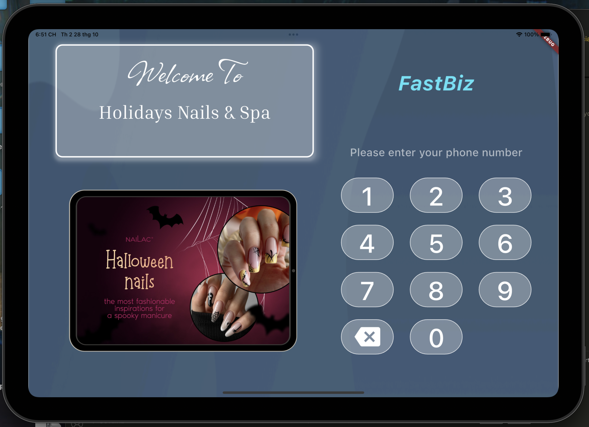
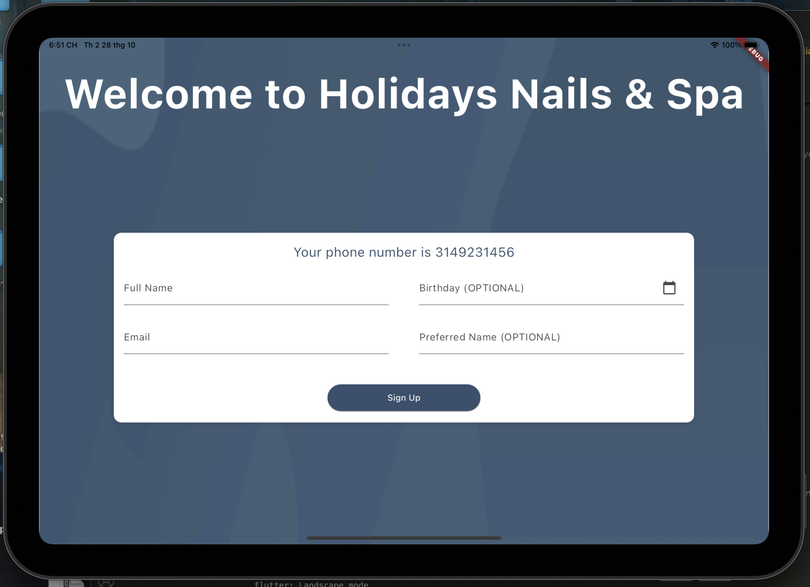
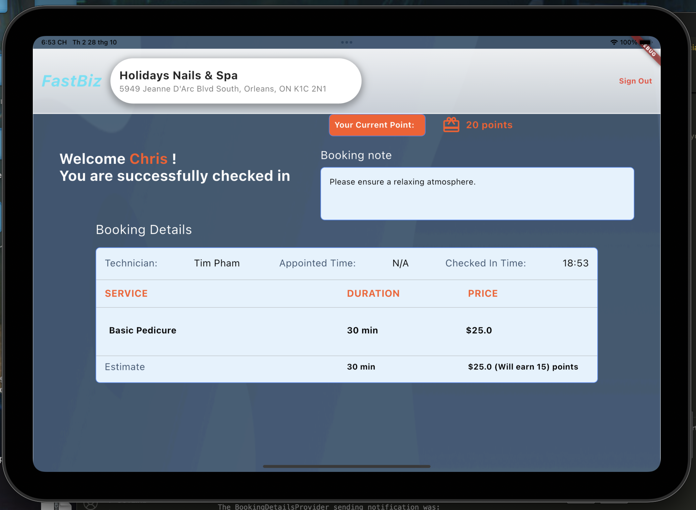
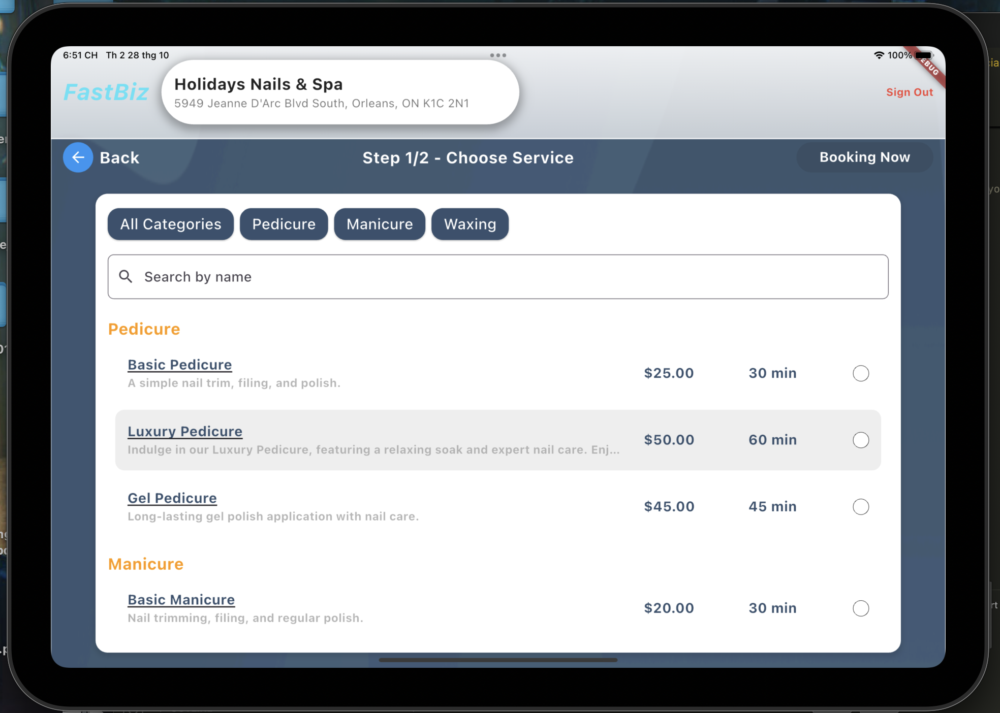
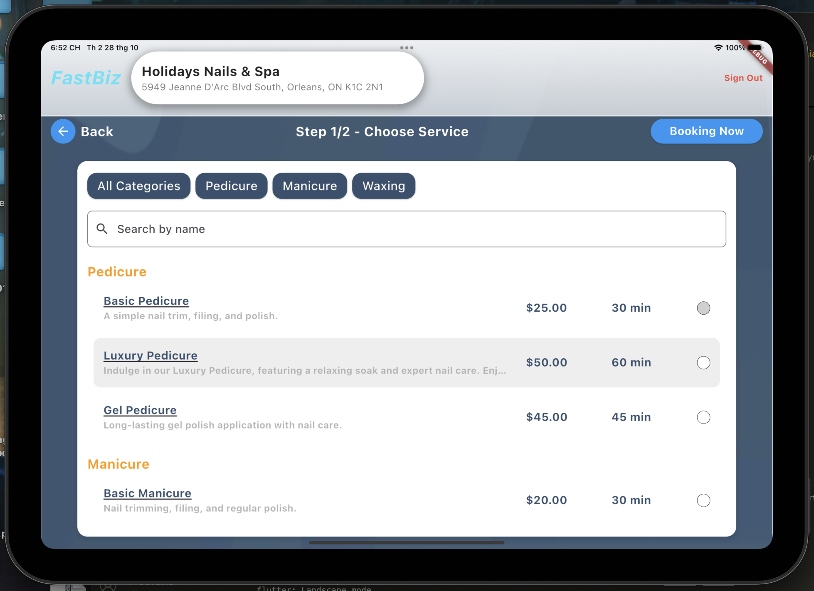
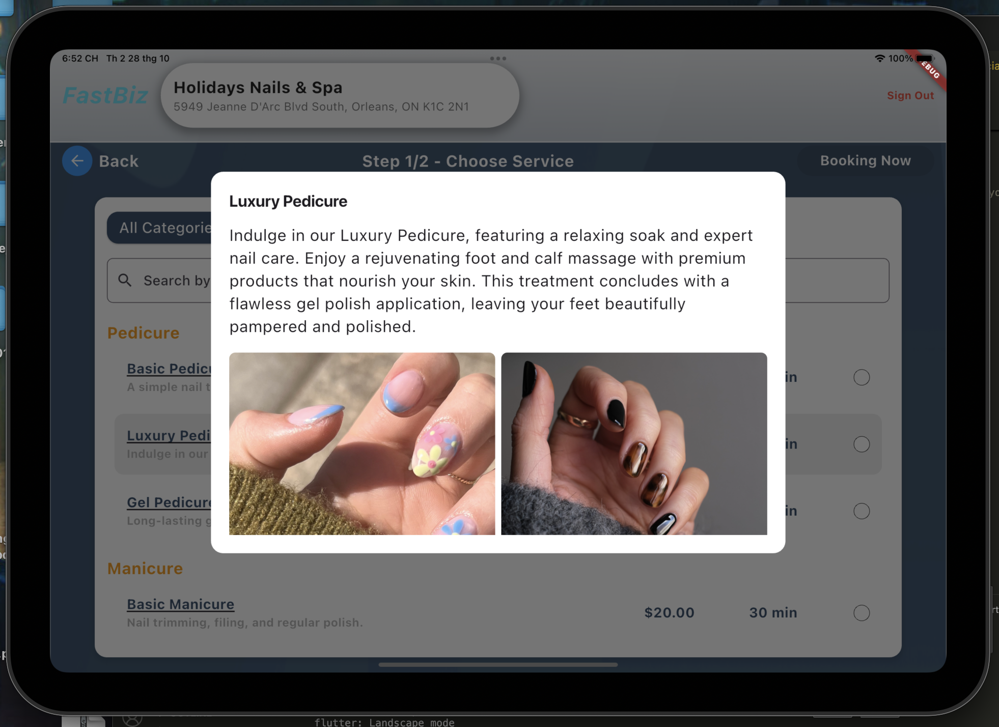
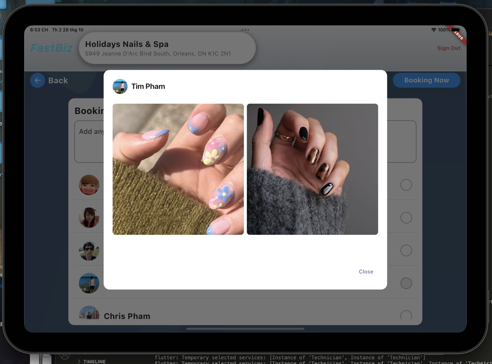

# Customer Check In Interface

<div align="center">

A modern, Flutter-based customer check-in and service booking interface for nail salons and spas.

</div>

## 📱 App Overview
Customer Check In Interface is a tablet-optimized Flutter application designed for Holidays Nails & Spa, streamlining the customer check-in experience and service management. The app features a modern UI with smooth animations and an intuitive booking flow.

## ✨ Key Features

### Check-in System
- Phone number-based check-in with numeric keypad
- Animated service advertisements during check-in
- New customer registration with optional fields
- Elegant welcome screen with business branding

### Service Management
- Categorized services (Pedicure, Manicure, Waxing)
- Interactive service cards with hover effects
- Detailed service descriptions with images
- Dynamic pricing and duration display
- Points earning system integration

### Staff Features
- Technician profiles with portfolio
- Real-time availability tracking
- Work samples gallery
- Individual service specializations

### Booking Flow
- Two-step booking process
  - Step 1: Service Selection
  - Step 2: Technician Selection
- Custom booking notes
- Points tracking system
- Real-time status updates

## 🛠 Technical Implementation

### Core Technologies
```yaml
framework: Flutter (latest)
language: Dart
state_management: Provider
ui_components: Material Design 3
```

### Key Packages
```yaml
dependencies:
  flutter:
    sdk: flutter
  provider: ^6.0.0
  cached_network_image: ^3.2.0
  shared_preferences: ^2.0.0
  intl: ^0.17.0
```

### Project Structure
```
lib/
├── main.dart
├── screens/
│   ├── welcome_screen.dart
│   ├── service_selection_screen.dart
│   ├── technician_selection_screen.dart
│   └── booking_confirmation_screen.dart
├── widgets/
│   ├── numeric_keypad.dart
│   ├── service_card.dart
│   ├── technician_list_item.dart
│   └── booking_details.dart
├── models/
│   ├── service.dart
│   ├── technician.dart
│   └── booking.dart
└── utils/
    ├── constants.dart
    └── theme.dart
```

## 🚀 Getting Started

1. Install Flutter:
```bash
git clone https://github.com/flutter/flutter.git
export PATH="$PATH:`pwd`/flutter/bin"
```

2. Clone the repository:
```bash
git clone https://github.com/YourUsername/customer-check-in.git
cd customer-check-in
```

3. Get dependencies:
```bash
flutter pub get
```

4. Run the app:
```bash
# For tablet optimization
flutter run -d tablet

# For specific device
flutter run -d [device-id]
```

## 📱 Device Configuration

### Tablet Mode (Recommended)
```bash
# iOS Simulator
open -a Simulator
xcrun simctl create "iPad Pro" com.apple.CoreSimulator.SimDeviceType.iPad-Pro-11-inch-4th-generation

# Android Emulator
flutter emulators --create --name tablet
flutter emulators --launch tablet
```

### Development Settings
- Minimum iPad Size: 10.2 inches
- Orientation: Landscape
- Target Platform: iOS/Android tablets

## 📸 Screenshots

### Directory Structure
```
screenshots/
├── check-in/
│   └── phone-entry.png         # Initial check-in screen with keypad
├── confirmation/
│   └── booking-details.png     # Booking confirmation view
├── registration/
│   └── new-customer.png        # New customer form
├── services/
│   ├── service-details.png     # Service modal view
│   ├── service-hover.png       # Service card hover state
│   └── service-list.png        # Main service selection
└── technicians/
    ├── tech-list.png          # Staff selection view
    └── tech-portfolio.png     # Portfolio modal
```

### Check-in Flow
| Screen | Description | Features |
|--------|-------------|-----------|
|  | Phone Number Entry | • Numeric keypad<br>• Animated advertisement display<br>• Error validation |
|  | New Customer Registration | • Optional fields<br>• Form validation<br>• Birthday picker |
|  | Booking Confirmation | • Points display<br>• Service summary<br>• Booking notes |

### Service Selection
Interactive service cards with rich hover states and detailed information:

<table>
  <tr>
    <td><br><em>Service Categories View</em></td>
    <td><br><em>Service Card Hover State</em></td>
  </tr>
</table>

#### Service Details Modal

- 💫 Long press or click to view detailed service information
- 🖼️ Service preview images
- 💰 Pricing and duration details
- 📝 Complete service description

### Technician Selection
Interactive technician profiles with portfolio display:

<table>
  <tr>
    <td><br><em>Technician Selection Screen</em></td>
    <td><br><em>Portfolio Modal View</em></td>
  </tr>
</table>

#### Interaction Features
- 👆 Tap to select technician
- 🖱️ Hover to preview portfolio
- ⌛ Long press for full portfolio modal
- 🎯 Real-time availability status

## 🔄 Current Status
- ✅ UI Implementation
- ✅ Check-in Flow
- ✅ Service Selection
- ✅ Technician Profiles
- ✅ Points System Integration
- ✅ Booking Management

## 🎯 Future Enhancements
- [ ] Online Appointment Scheduling
- [ ] Push Notifications
- [ ] Customer History Tracking
- [ ] Advanced Analytics Dashboard
- [ ] Multi-language Support

## 👥 Contributors
Designed and developed by Chris Pham

## 📄 License
Proprietary software - Holidays Nails & Spa
